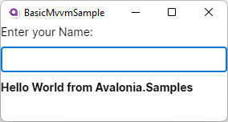
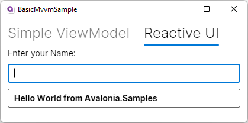

# Basic MVVM Sample

This sample will show you, how you can use the `MVVM`-pattern to receive and process text input by the user. Our sample App will have one `TextBox` where the users can enter their name and one `TextBlock` where we will send some personal greetings.

**Difficulty**

:hatching_chick: Beginner :hatching_chick:

**Buzz-Words**

MVVM, Model-View-ViewModel, ReactiveUI, INotifyPropertyChanged, XAML, Binding

## Before we start

### Prepare your IDE
Please make sure you have setup your IDE according to the [[docs](https://docs.avaloniaui.net/docs/getting-started/ide-support)]. Moreover you should have read the [[Getting Started guide](https://docs.avaloniaui.net/docs/getting-started)]. 

### The MVVM Pattern in short

We will use the `MVVM`-pattern in this sample. `MVVM` is short for **M**odel - **V**iew - **V**iew**M**odel and describes a software architectural pattern that will split the code base into three pieces:

- **Model**: The `Model` will store and handle your data. The model doesn't know your `View` or `ViewModel`.
- **View**: The `View` can be thought as the UserInterface and will interact with your `ViewModel`. 
- **ViewModel**: The `ViewModel` can be seen as a mediator between the `View` and the `Model`. It will know about the `Model` and is known by the `View`, but it doesn't know anything about the `View`. It can transform and convert the data provided by the `Model`, if needed.

This pattern helps us to focus on either of the three parts. If we get new values in our `Model`, the `ViewModel` will notify the `View` about it and the `View` can update itself. We don't have to do it manually. If you want to read more about it, here is a collection of useful links:

- <a href="https://docs.avaloniaui.net/guides/basics/mvvm" target="_blank">[Avalonia Docs]</a>
- <a href="https://en.wikipedia.org/wiki/Model%E2%80%93view%E2%80%93viewmodel" target="_blank">[Wikipedia]</a>
- <a href="https://www.codeproject.com/Articles/278901/MVVM-Pattern-Made-Simple" target="_blank">[CodeProject]</a>
- <a href="https://www.tutorialspoint.com/mvvm/index.htm" target="_blank">[tutorialspoint]</a>

### INotifyPropertyChanged

Our view needs any way to know when a property has changed and the view should update itself. To achieve this there is an interface called `INotifyPropertyChanged` which implements the event `PropertyChanged`. If our `ViewModel` implements this interface, we can send update notifications to our `View` or any other class listening to that event. 

More: <a href="https://docs.microsoft.com/en-US/dotnet/api/system.componentmodel.inotifypropertychanged?view=net-6.0" target="_blank">[Microsoft Docs]</a>

### Bindings

We need a way to connect the properties of our controls (like the `Text`-property of a `TextBox`) with our properties in the the `ViewModel`. Luckily we have  [[`Bindings`](https://docs.avaloniaui.net/docs/data-binding/bindings)] which will do this for us. The `Binding` will update the the `View` whenever the `ViewModel` reports changes and will also update the `ViewModel` whenever the user interacts with the `View`. 


### Create a new Project

Create a new "Avalonia MVVM Application" Project either via `File ► New Project ► Avalonia MVVM Project`:


Or via command line: 

```txt
dotnet new avalonia.mvvm -o BasicMvvmSample
cd BasicMvvmSample
```

## Solution 1 : Implement INotifyPropertyChanged on our own

In this sample we will show you how you can implement and use the interface `INotifyPropertyChanged` on your own. 

### Step 1: Create SimpleViewModel

In our project structure we have a folder called `ViewModels`. We will add a new class called "SimpleViewModel" there. This class should implement `INotifyPropertyChanged` like shown below: 

```cs
// Remember to add this to your usings 
using System.ComponentModel;

namespace BasicMvvmSample.ViewModels
{
    // This is our simple ViewModel. We need to implement the interface "INotifyPropertyChanged"
    // in order to notify the View if any of our properties changed.
    public class SimpleViewModel : INotifyPropertyChanged
    {
        // This event is implemented by "INotifyPropertyChanged" and is all we need to inform 
        // our view about changes.
        public event PropertyChangedEventHandler? PropertyChanged;
    }
}
```

For convenience we will now add a method to our class, which will raise the event for us. We need to provide the name of the property which has changed. If we add `[CallerMemberName]` to the method argument, the compiler will add the property name for us. 

```cs
// Remember to add this to your usings
using System.Runtime.CompilerServices;

[...]

private void RaisePropertyChanged([CallerMemberName] string? propertyName = null)
{
    PropertyChanged?.Invoke(this, new PropertyChangedEventArgs(propertyName));
}
```

### Step 2: Add Properties to our ViewModel

We want the user to be able to enter their name. This text will later be used to greet the user. So let's add the properties `Name` and `Greeting` to our `ViewModel`:

```cs
private string? _Name; // This is our backing field for Name

public string? Name
{
    get 
    {
        return _Name; 
    }
    set
    {
        // We only want to update the UI if the Name actually changed, so we check if the value is actually new
        if (_Name != value)
        {
            // 1. update our backing field
            _Name = value;

            // 2. We call RaisePropertyChanged() to notify the UI about changes. 
            // We can omit the property name here because [CallerMemberName] will provide it for us.  
            RaisePropertyChanged();

            // 3. Greeting also changed. So let's notify the UI about it. 
            RaisePropertyChanged(nameof(Greeting));
        }
    }
}

// Greeting will change based on a Name.
public string Greeting
{
    get
    {
        if (string.IsNullOrEmpty(Name))
        {
            // If no Name is provided, use a default Greeting
            return "Hello World from Avalonia.Samples";
        }
        else
        {
            // else Greet the User.
            return $"Hello {Name}";
        }
    }
}
```

### Step 3: Add SimpleViewModel to MainWindowViewModel

Our view will only consist of one [[`Window`](https://docs.avaloniaui.net/docs/controls/window)] called `MainWindow`. Its [[`DataContext`](https://docs.avaloniaui.net/docs/data-binding/the-datacontext)] is the class `MainWindowViewModel` which was added by the template. We will just add an instance of our `SimpleViewModel` to it: 

```cs
// Add our SimpleViewModel.
// Note: We need at least a get-accessor for our Properties.
public SimpleViewModel SimpleViewModel { get; } = new SimpleViewModel();
```

### Step 4: Setup the View 

Now we can start with the UI layout. Our View will be written in [[`XAML`](https://docs.avaloniaui.net/guides/basics/introduction-to-xaml)]. 

#### Enable Compiled Bindings

> Note: This step is optional, but highly recommended.

We enable [[`CompiledBindings`](https://docs.avaloniaui.net/docs/data-binding/compiledbindings)] in our `Window` by adding `x:DataType` and `x:CompileBindings` to the root node. This has many benefits such as better performance and better debugging experience. 

```xml
<Window xmlns="https://github.com/avaloniaui"
        xmlns:x="http://schemas.microsoft.com/winfx/2006/xaml"
        xmlns:vm="using:BasicMvvmSample.ViewModels"
        xmlns:d="http://schemas.microsoft.com/expression/blend/2008"
        xmlns:mc="http://schemas.openxmlformats.org/markup-compatibility/2006"
        mc:Ignorable="d" d:DesignWidth="800" d:DesignHeight="450"
        x:CompileBindings="True" 
        x:DataType="vm:MainWindowViewModel"
        x:Class="BasicMvvmSample.Views.MainWindow"
        Icon="/Assets/avalonia-logo.ico"
        Title="BasicMvvmSample">
</Window>
```

#### Add the Content to MainWindow

Or `View` will be build using [[`TextBoxes`](https://docs.avaloniaui.net/docs/controls/textbox)]. One for the user to enter their name and another one to present the greeting. As a `Window` can only have one child, we need to wrap our controls in a [[`Panel`](https://docs.avaloniaui.net/docs/layout)]. We will choose a [[`StackPanel`](https://docs.avaloniaui.net/docs/controls/stackpanel)], but you can use any other Panel as well. 

The `StackPanel`'s `DataContext` will [[bind](https://docs.avaloniaui.net/docs/data-binding/bindings)] to our `SimpleViewModel`. As the DataContext is inherited from the parent control, our `TextBoxes`  will have the same `DataContext`. Therefor we can just bind `TextBox.Text` to `Name` and `Greeting` respectively: 

```xml
<Window xmlns="https://github.com/avaloniaui"
        xmlns:x="http://schemas.microsoft.com/winfx/2006/xaml"
        xmlns:vm="using:BasicMvvmSample.ViewModels"
        xmlns:d="http://schemas.microsoft.com/expression/blend/2008"
        xmlns:mc="http://schemas.openxmlformats.org/markup-compatibility/2006"
        mc:Ignorable="d" d:DesignWidth="800" d:DesignHeight="450"
        x:CompileBindings="True"
        x:DataType="vm:MainWindowViewModel"
        x:Class="BasicMvvmSample.Views.MainWindow"
        Icon="/Assets/avalonia-logo.ico"
        Title="BasicMvvmSample">
    
    <!-- This is just used by the designer / previewer -->
	<Design.DataContext>
        <vm:MainWindowViewModel/>
    </Design.DataContext>

	<!-- Our Simplie ViewModel-->
	<StackPanel DataContext="{Binding SimpleViewModel}" Spacing="10">
		<TextBlock>Enter your Name:</TextBlock>
		<TextBox Text="{Binding Name}" />
		<TextBox Text="{Binding Greeting, Mode=OneWay}"
				 IsReadOnly="True"
				 FontWeight="Bold" />
	</StackPanel>
</Window>
``` 

Please note that we use `Mode=OneWay` in the `Binding` for `Greeting`, because `Greeting` is read-only and the default `Mode` of `TextBox.Text` is `TwoWay`. Moreover we made this `TextBox` read-only, so the user will not be able to change the `Text` by accident. 

### Step 5: See it in action

In your IDE hit `Debug [F5]`. You should see the following result: 



## Solution 2 : Using ReactiveUI

We don't need to implement all the boilerplate code on our own over and over again. Instead, we can use any existing `MVVM` framework out there. If you create a new "Avalonia MVVM Project", you will have already [[ReactiveUI](https://www.reactiveui.net)] installed. So let's see how we can use ReactiveUI to achieve the same sample as above.

### Step 1: Create ReactiveViewModel

Again we start by adding a new class called "ReactiveViewModel" into the `ViewModels` folder. This time we will use `ReactiveObject` as our base class. This class already implements `INotifyPropertyChanged`, so we don't need to implement it again.

```cs
using ReactiveUI;
using System;

namespace BasicMvvmSample.ViewModels
{
    // Instead of implementing "INotifyPropertyChanged" on our own we use "ReachtiveObject" as 
    // our base class. Read more about it here: https://www.reactiveui.net
    public class ReactiveViewModel : ReactiveObject
    {
    }
}
```

### Step 2: Add Properties to our ViewModel

Our `Name`-property has now less boilerplate code in the setter, as we can use ReactiveUI's `RaiseAndSetIfChanged` method: 

```cs
private string? _Name; // This is our backing field for Name

public string? Name
{
    get
    {
        return _Name;
    }
    set
    {
        // We can use "RaiseAndSetIfChanged" to check if the value changed and automatically notify the UI
        this.RaiseAndSetIfChanged(ref _Name, value);
    }
}
```

`Greeting` does not need to be modified and can be copied from `SimpleViewModel`. But wait, do we notify the `View` somehow that Greeting should update? Yes, we need a way to do. In ReactiveUI we can use [[`WhenAnyValue`](https://www.reactiveui.net/docs/handbook/when-any/#whenanyvalue)] to listen and react to property changes. We will setup that listener in the constructor of our `ReactiveViewModel`. 

```cs
public ReactiveViewModel()
{
    // We can listen to any property changes with "WhenAnyValue" and do whatever we want in "Subscribe".
    this.WhenAnyValue(o => o.Name)
        .Subscribe(o => this.RaisePropertyChanged(nameof(Greeting)));
}
```

To explain the above code in short: `WhenAnyValue` will listen to changes of the property specified in the lambda. In `Subscribe` we define what should happen if the value changed. In our case, we want to `RaisePropertyChanged` for `Greeting`.

### Step 3: Add ReactiveViewModel to MainWindowViewModel

similar to how we added `SimpleViewModel`

```cs
// Add our RactiveViewModel
public ReactiveViewModel ReactiveViewModel { get; } = new ReactiveViewModel();
```

### Step 4: Modify the View 

We can use both `ViewModels` side by side. To demonstrate this, we will wrap both `Views` in a `TabControl`. As our properties have the same names, we can just copy & paste the view we have and just need to replace the `DataContext`:

```xml
<Window xmlns="https://github.com/avaloniaui"
        xmlns:x="http://schemas.microsoft.com/winfx/2006/xaml"
        xmlns:vm="using:BasicMvvmSample.ViewModels"
        xmlns:d="http://schemas.microsoft.com/expression/blend/2008"
        xmlns:mc="http://schemas.openxmlformats.org/markup-compatibility/2006"
        mc:Ignorable="d" d:DesignWidth="800" d:DesignHeight="450"
        x:CompileBindings="True"
		x:DataType="vm:MainWindowViewModel"
        x:Class="BasicMvvmSample.Views.MainWindow"
        Icon="/Assets/avalonia-logo.ico"
        Title="BasicMvvmSample">

[...]

	<TabControl>
		
		<!-- Our Simplie ViewModel -->
		<TabItem Header="Simple ViewModel" >
			[...] <!-- See Solution 1 --> 
		</TabItem>

		<!-- Our ReactiveViewModel -->
		<TabItem Header="Reactive UI" >
			<StackPanel DataContext="{Binding ReactiveViewModel}" Spacing="10">
				<TextBlock>Enter your Name:</TextBlock>
				<TextBox Text="{Binding Name}" />
				<TextBox Text="{Binding Greeting, Mode=OneWay}"
						 IsReadOnly="True"
						 FontWeight="Bold" />
			</StackPanel>
		</TabItem>
		
	</TabControl>
</Window>
```
### Step 5: See it in action

In your IDE hit `Debug [F5]`. You should see the following result: 



## Solution 3 : Use any other MVVM Framework

Even though Avalonia ships ReactiveUI by default, you are not tied to it. You can use it side by side with other MVVM Frameworks or can completely replace it. Among others here is a short list of famous MVVM Frameworks:

- <a href="https://www.reactiveui.net" target="_blank">[ReactiveUI]</a>
- <a href="https://docs.microsoft.com/en-us/windows/communitytoolkit/mvvm/introduction" target="_blank">[CommunityToolkit.MVVM]</a>
- <a href="https://prismlibrary.com/docs/" target="_blank">[Prism]</a>
- <a href="https://caliburnmicro.com" target="_blank">[Caliburn Micro]</a>
- ... And many more.

## Related

Are you looking for more advanced tutorials? Find them here: 

- <a href="https://docs.avaloniaui.net/tutorials/todo-list-app" target="_blank">[ToDo List App]</a>
- <a href="https://docs.avaloniaui.net/tutorials/music-store-app" target="_blank">[Music Store App]</a>
- <a href="https://github.com/AvaloniaCommunity/awesome-avalonia#tutorials" target="_blank">[Awesome-Avalonia]</a>